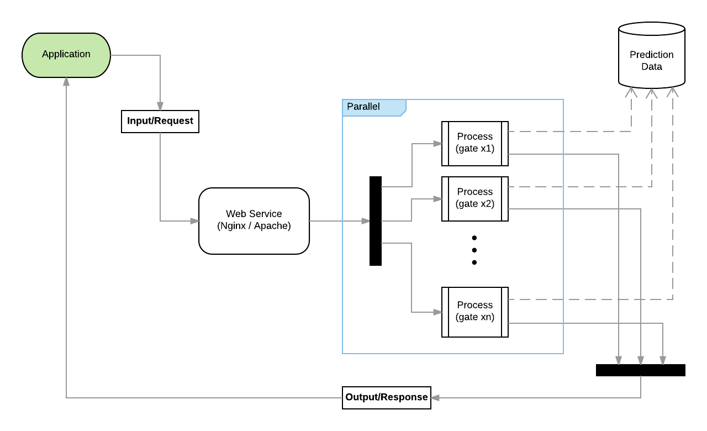
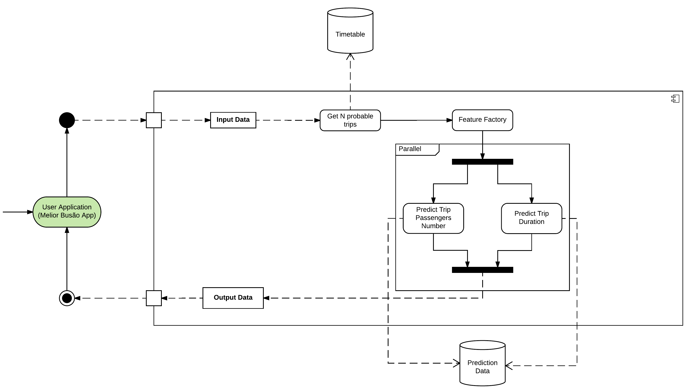

# Recommendation Service Manager

The Recommendation Service Manager holds the procedure of paralleling multiple requests to the BestTripRecommender.

Its architecture is structured as shown below:

The _Application_ makes several requests to the _Web Service_. This one is responsable for distributing those requests into multiple _processes_, each one will execute in an individual gate of our Virtual Machine in a parallelized way. These processes receive the requests with the input data and apply our prediction algorithms. Thereunto, the processes need to access our database that contains historical data about buses trips. This data is processed and the output is sent to the application.

The detailed procedure that occurs in each of those processes is described right below.

# BestTripRecommender

The Best Trip Recommender is a service that allows you to create a prediction system for the public transportation services of your city.
So far the system can predict the duration of a trip and its number of passengers.

The recommender architecture is structured as shown below:

* The _User Application_ is an app that provides the input data necessary for the system to generate a prediction and also receives the output data from the recommender.

* The _Input Data_ must contain the following content:
    * Route: Bus route 
    * Time: Time in format HH:MM:SS
    * Date: Date in format DD-MM-YY
    * Stop ID: ID of the bus stop
    
* The _Get N probable trips_ uses the bus _Timetable_ data to get N trips (N = 3 as default) as base for the prediction. This module filters trips in the same route, week day and stop id passed by the user, then it get the N closest trips of the timetable passed by the user.

* The _Timetable_ is a storage that holds succint data of real accomplished bus trips in a predefined amount of time. Based on data from accomplished bus trips (not the data of scheduled trips) through statistical methods we generated this data that contains the mean, inferior limit and superior limit for the time the buses arrived at the bus stops. The recommender will use this data to identify which of the real trips is closest in schedule to the one passed as _Input Data_. The Timetable data storage should contain these fields: 
    * route: The name of the bus route/line (examples: "003B", "101")
    * day\_type: The day type field is a feature that groups weekdays according to their similarity in the bus schedules. For instance, if Tuesday, Wednesday and Thursday are weekdays with similar bus schedules, then they three should be in a single day\_type ("TUE WED THU").
    * stop_id: Identifier of a bus stop.
    * mean_timetable: Historically, the mean time when the bus has arrived in the bus stop.
    * lower_timetable: Statistically, the earliest time that the bus is supposed to arrive at the bus stop.
    * upper_timetable: Statistically, the latest time that the bus is supposed to arrive at the bus stop .
    * trip_start: The time when the bus trip has started, that is, considering that every trip has an initial and final stops, this is the time when the bus left the initial stop. 
    * trip_end: the time when the bus arrived at the final stop.
    
     

* The _Feature Factory_ module creates new features based on the user data and the N probable trips. Currently it extracts the following features:
    * week.day: the week day.
    * difference.previous.timetable: the difference between the central timetable and the previous one.
    * difference.next.timetable: the difference between the central timetable and the next one.
    * grouped.timetable: the floor function applied on the time.
    * difference.next.timetable: difference between the central timetable and the next one.
    * difference.previous.timetable:difference between the central timetable and the previoius one.
     

After the feature extraction in the _Feature Factory_ module the data already contains the feature necessary to predict the number of passengers and the trip duration.

* The _Predict Trip Passengers Number_ predicts the trip number of passengers based on the _Prediction Data_

* The _Predict Trip Duration_ predicts the trip duration based on the _Prediction Data_

* The _Prediction Data_ contains all the historical data about accomplished bus trips in a certain period of time. Differently of _Timetable_ data, this one does not contain succint data of the trips. It contains data of all the trips made, each one individually. The fields for the data are:
    * route: The name of the bus route/line.
    * date: The date when the trip took place. The format is "yyyy-mm-dd".
    * departure: The time (in milliseconds) of bus departure from its initial stop.
    * arrival: The time (in milliseconds) of bus arrival in its final stop.
    * duration: The duration (in minutes) of the bus trip.
    * week.day: The weekday when the trip took place (example: "Wednesday").
    * total.passengers: The total amount of passengers that took that trip.
    * difference.previous.timetable: The time difference (in minutes) between the durations of the actual trip and the trip that happened before.
    * difference.next.timetable: The time difference (in minutes) between the durations of the actual trip and the trip that happened after.     

* The _Output Data_ contains the N probable trips, each one with the following content:
    * route: route passed by the user.
    * date: date passed by the user.
    * week.day: week day of the date.
    * trip.initial.time: initial time of the trip wich passes in the closest timetable in the stop.
    * trip.final.time: final time of the trip wich passes in the closest timetable in the stop.
    * grouped.timetable: the floor function applied on the time.
    * difference.previous.timetable: difference between the trip and the previous one.
    * difference.next.timetable: difference between the trip and the next one.
    * day.type: day type that can be  "SUN", "MON", "TUE WED THU", "FRI", "SAT". 
    * mean.timetable: closest timetable from the user time.
    * time.difference: difference in seconds between the timetable and the central timetable.
    * passengers.number: predicted number of passengers of the trip.
    * trip.duration: predicted duration of the trip.
